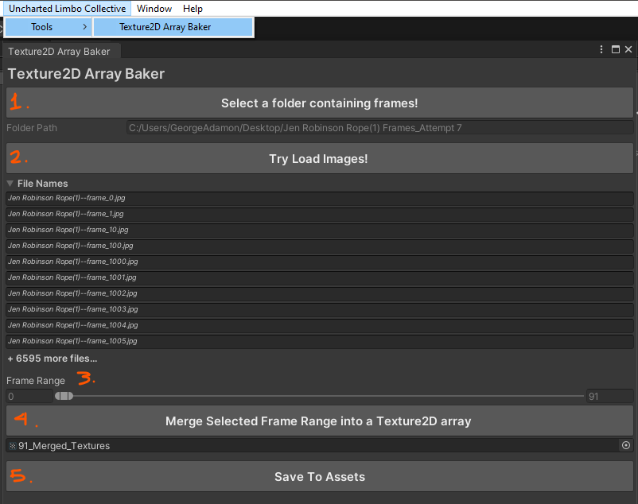

# Texture2D Array Baker for Unity
 Unity Editor Utility that enables the baking of individual animation frames stored in the disk as `Texture2DArray` assets.
 
## Add as a Unity Package
Add this line to your `Packages/manifest.json` file
```js
"ulc-tools-texture_array_baker": "https://github.com/Uncharted-Limbo-Collective/unity-texture-array-baker.git?path=/UnityProject/Packages/TextureArrayBaker#master",
```

## Usage

